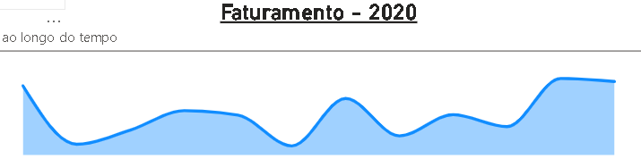
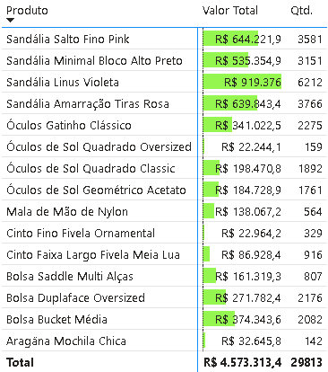
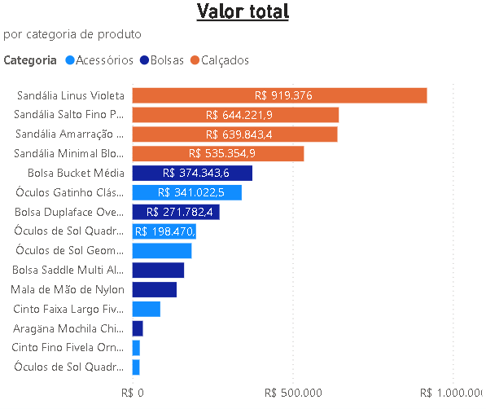
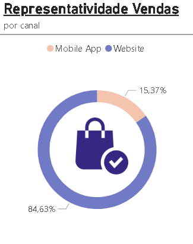

# Dashboard Ecommerce

Dashboard criado para fazer a análise dos dados de vendas de um ecommerce fictício de calçados e acessórios, com base em um arquivo xlsx de Excel, para apoio a tomada de decisão.

Análises:

- Gráfico de linha analisando a evolução de vendas ao longo do ano

  
  
- Análise da quantidade vendida de cada produto

  
  
- Valor total por categoria

  
  
- Gráfico de setores que demonstra a presentatividade de vendas por canal

  

- Painel que resume o ecommerce, visualizando o faturamento total, quantidade de vendas do ano, quantidade de clientes, quantidade de pedidos

  

  
